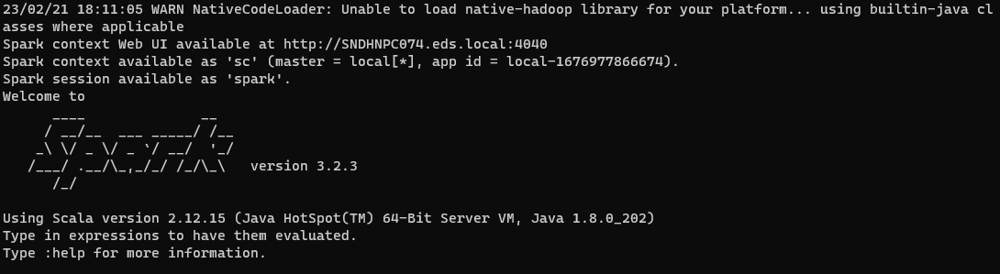

# Window guide

### In order to install spark on Window, you need these 4 step

1. Install Java
2. Install Python
3. Install Spark
4. Install Hadoop
## steps:
#### install Python environment
- Download python from this link: 
```commandline
https://www.python.org/downloads/
```
- installing python
- create a new python environment
```bash
python -m  venv <your_path>/<your_env_name>
```
- actvate your newly created environment:
```bash
<your_environment_path>\Scripts\activate.bat
```

#### Set up Spark

- download spark : 
```
https://spark.apache.org/downloads.html
```
- extract the downloaded file
- place the folder in any place you want ( recommended C:\ folder)
- set the system environment path accordingly

###### example
- My spark folder location is at ```C:\Users\duongpb\spark-3.2.3-bin-hadoop3.2```

- Note: we need to set the SPARK_HOME as the path: ```C:\Users\duongpb\spark-3.2.3-bin-hadoop3.2```
and add the system path : ```C:\Users\duongpb\spark-3.2.3-bin-hadoop3.2\bin```

#### Set up Hadoop
- For this learning and project we will be focusing on Spark and therefore, we will bypass the Hadoop system by
using a mock system by setting the file Winutils.exe as Hadoop home in order to bypass the Hadoop system
- for linux system, you need to install manually Hadoop
###### example
- My location of Hadoop is at : ```C:\Users\duongpb\Hadoop```
- Note: we need to set the HADOOP_HOME as the path : ```C:\Users\duongpb\Hadoop``` and 
add the system path :```C:\Users\duongpb\Hadoop\bin```

#### double check 
- to check and see whether you have successfully installed Spark, open your cmd and type: 
```spark-shell```
- if your screen show something like this then it's all done:


###### we will run spark locally for this project
