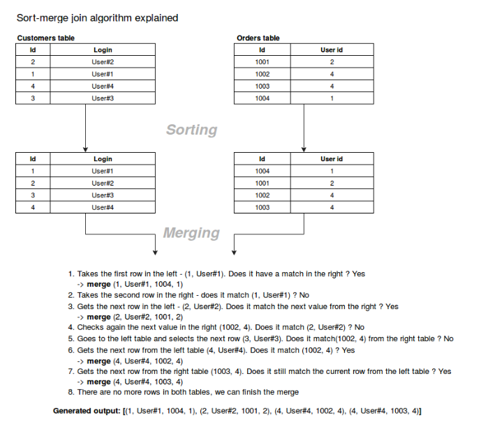

# Definition
Apache Spark is a unified analytics engine for large-scale data processing.
It provides high-level APIs in Java, Scala, Python and R, and an optimized engine that supports general execution graphs. 
It also supports a rich set of higher-level tools including Spark SQL for SQL and structured data processing, pandas API on Spark for pandas workloads, MLlib for machine learning, GraphX for graph processing, and Structured Streaming for incremental computation and stream processing.


We have 3 type of spark which are : 
- spark RDD 
- spark Dataframe
- spark Dataset

Spark can run in three different modes: Standalone, YARN and Mesos

Spark can also be use as an alternative of MapReduce in Hadoop eco system so 
in order to run a spark pineline, it's recommended that we use hadoop eco system
to run it instead of standalone mode.

so in order to install spark, we need to install these 4 things: 
1. java
2. python
3. spark
4. hadoop

# Installation 

## window

###### In order to install spark on Window, you need these 4 step

1. Install Java
2. Install Python
3. Install Spark
4. Install Hadoop

### steps
#### install Python environment
- Download python from this link: 
```commandline
https://www.python.org/downloads/
```
- installing python
- create a new python environment
```bash
python -m  venv <your_path>/<your_env_name>
```
- actvate your newly created environment:
```bash
<your_environment_path>\Scripts\activate.bat
```

#### Set up Spark

- download spark : 
```
https://spark.apache.org/downloads.html
```
- extract the downloaded file
- place the folder in any place you want ( recommended C:\ folder)
- set the system environment path accordingly

###### example
- My spark folder location is at ```C:\Users\duongpb\spark-3.2.3-bin-hadoop3.2```

- Note: we need to set the SPARK_HOME as the path: ```C:\Users\duongpb\spark-3.2.3-bin-hadoop3.2```
and add the system path : ```C:\Users\duongpb\spark-3.2.3-bin-hadoop3.2\bin```

#### Set up Hadoop
- For this learning and project we will be focusing on Spark and therefore, we will bypass the Hadoop system by
using a mock system by setting the file Winutils.exe as Hadoop home in order to bypass the Hadoop system
- for linux system, you need to install manually Hadoop
###### example
- My location of Hadoop is at : ```C:\Users\duongpb\Hadoop```
- Note: we need to set the HADOOP_HOME as the path : ```C:\Users\duongpb\Hadoop``` and 
add the system path :```C:\Users\duongpb\Hadoop\bin```

#### double check 
- to check and see whether you have successfully installed Spark, open your cmd and type: 
```spark-shell```
- if your screen show something like this then it's all done:

###### we will run spark locally for this project

### Linux

# SparkRDDs

### Count
- count() is use to count the number of elements in a RDD
- create a new RDD

#### countByValue
- it will count the times that the value happens. 
We can use this to count the appear time of a string in a list.

### Distinct
- use to get the distinct elements in RDD
- create a new RDD
- syntax: 
```commandline
rdd.distinct()
```

### Filter
- use to remove element out of a RDD
- create a new RDD
- the comparison return a true or false logic
- syntax : 
```
rdd.filter(lambda x: x!=123)
```

### groupBykey
- Group by key is used to create groups based on Keys in RDD
- the data needs to be in this format
```
(k,v), (k,v), (k2, v),.... : tuples
```
- it creates new RDD
syntax: 
```
rdd.groupByKey()
```
mapValue(list) are usually used to get the group data
where the one inside the () is the data type that we want to display the value

To run the job in example, use this command:
```set PYSPARK_PYTHON=python```

```
spark-submit GroupByKey.py
```

### Map
- Map() is used to apply a function, a logic or anything we want to each elements of the RDD collection

#### FlatMap
- Flat map is used as a maper of data and explodes data before final output
- it create a new RDD, this also can be apply with a function or lambda
- syntax: 
```commandline
rdd.flatMap(lambda x:x.split())
```
- flatmap will apply map into 1 level lower as it will flatten everything into
1 unified type of elements

#### Function
We can use spark Map() and then put a function inside of it in order to apply all RDD element with that function

eg: 
```
def foo(x):
    # eg data : 1 2 3 then 4 5 6 8 then ...
    return_list = []
    # split to seperate characters
    for i in x.split(' '):
        # transform each character then transform them and finally add them to the return_list
        return_list.append(int(i) + 2)
    return return_list

transformed_rdd = text.map(foo)
```

#### Lambda
Using Map() to execute a simple logic, we can use lambda expression, by this way, we can save the LOC by reducing the action of declaring a function

eg:
```python
rdd.map(lambda x:x.split())
```

### Partitions
- each RDDs is using partition to processing data in parallel, the performance of the job is basing on the number of partition and spark gives us the power
to control this as well.

By default we have 2 partitions for each RDD

- syntax to reduce the number of partitions: 
```commandline
rdd.coalesce(number_of_partitions)
```
- syntax to increase or change the number of partitions:
```commandline
rdd.repartition(number_of_partitions)
```

to check the rdd partition we use : 
```commandline
rdd.getNumPartitions()
```

### reduceByKey
- Reduce by key is used to combined data base on Keys in RDD and then apply a reduce logic to them
- the data needs to be in this format
```commandline
(k,v), (k,v), (k2, v),.... : tuples
```
``````
example: ("Apple", 1), ("Ball", 1), ...
``````
- it creates new RDD
syntax: 
```commandline
rdd.reduceByKey(lambda x, y: x + y)
```
- this example above use a method like recursive
- reduceByKey can also be use to compare operator as well, not only boolean: 
- eg: 
```
# to show the min and max per course we do it like this flow:
# [course, mark] -> map[course, mark]
min_per_course = student_object.map(lambda x: [x[3], x[5]]).reduceByKey(lambda x, y: x if x < y else y)
min_per_course = student_object.map(lambda x: [x[3], x[5]]).reduceByKey(lambda x, y: x if x > y else y)
```

### Save as text file
- SaveAsTextFile is the method to extract the file out of a RDD

- A job can be seperate into different partition and then output the result
if we dont extract the file out then it will create as many files as the number of clusters we have

- we can check the number of partition by using 
rdd.getNumPartitions()

``````default are 2 partitions``````

# SparkSQL
- Spark SQL is a Spark module for structured data processing. Unlike the basic Spark RDD API, the interfaces provided by Spark SQL
provide Spark with more information about the structure of both the data and the computation being performed. 
Internally, Spark SQL uses this extra information to perform extra optimizations. There are several ways to interact with Spark SQL
including SQL and the Dataset API. When computing a result, the same execution engine is used, independent of which API/language you
are using to express the computation. This unification means that developers can easily switch back and forth between different 
APIs based on which provides the most natural way to express a given transformation.
- 
## Spark Data Frame
- A DataFrame is a Dataset organized into named columns. It is conceptually equivalent to a table in a relational database or a 
data frame in R/Python, but with richer optimizations under the hood. DataFrames can be constructed from a wide array of sources 
such as: structured data files, tables in Hive, external databases, or existing RDDs. The DataFrame API is available in Scala, 
Java, Python, and R. In Scala and Java, a DataFrame is represented by a Dataset of Rows.  In the Scala API, DataFrame is simply a type alias of Dataset[Row]. 
While, in Java API, users need to use Dataset<Row> to represent a DataFrame.
- Spark Data Frame use the Catalyst optimization, which gave it the ability to optimize the performance better and also provide with an execution plan

Spark Data Frame is built base on SparkRDD with an aim to process both structure and unstructured data with a more effective speed

### Count
allow to count for all the elements from a DF

using 
```commandline
count()
```

we can also drop all duplication by 
```commandline
dropDuplicates([name of the column])
multiple columns: 
dropDuplicates(["gender", "name"])
```

Distinct
```commandline
df.select("gender", "age").distinct()
```

### DF to RDD
we can transform a dataframe to RDD and vice versa

- To convert DataFrame to RDD, we need to use this syntax: 

```commandline
rdd = df.rdd
rdd.filter(lambda x: x[1] == "male").collect()
```

- After transforming, we can even provide the column name:
```commandline
rdd.filter(lambda x: x["age"] == 28).collect()
```

in case we need to have multiple grouping and continuous aggregation
, transforming from RDD to DF is a possible way, then we can conver them back 

### Group By
#### normal grouping
help DF to create a group of data so that we can aggregate later on
syntax: 

```commandline
df.groupBy("gender")
```
###### note that after grouping, you need to perform an aggregate or transformation for the data 
so we need to apply aggregation and it should be something like this: 
```commandline
df.groupBy("gender").sum("marks").show()
or
df.groupBy("course").count().show()
or
df.groupBy("age").avg("marks").show()
```

#### multiple Grouping
the grouping of multiple fields will happen with the exact number and by the order of the fields

for example: 
```commandline
df.groupBy("course").count().show()
```

This code will group by all the course, then once again group by the gender, then count for each group
so we will have the following group: 

| course | gender | count 
|--------|--------|-------|
| math   | female | 50    |
| math   | male   | 50    |
| literature | female | 20 |
| literature | male | 20|

#### multiple aggregation
```commandline
from pyspark.sql.functions import sum, avg, max, min, mean, count
```

then we have these line of code

```commandline
df.groupBy("course").agg(count("*"), sum("marks"))
```

###### note that it's safer to use the col("column_name") after aggregation because it will take the column of the transformed table, not the original table, which will be called if we use dataframe.column_name

### RDD to DF
we can convert a sparkRDD to DF, we need to have these credentials:
- a schema
- a RDD

an example of the code that do this: 

```
text = sc.textFile(('StudentData.csv'))
headers = text.first()
rdd = text.filter(lambda x: x != headers).map(lambda x: x.split(','))

print(rdd.collect())
# creating the DF with header base on the header we just create
# it apply the headers to every column of it
# note that we need sparkContext to use toDF
columns = headers.split(',')
dfRdd = rdd.toDF(columns)
dfRdd.show()
dfRdd.printSchema()

# creating DF from RDD with our own created schema
schema = StructType(
    [
        StructField("age", IntegerType(), True), # true mean this column can have a null value
        StructField("gender", StringType(), True),
        StructField("name", StringType(), True),
        StructField("course", StringType(), True),
        StructField("roll", StringType(), True),
        StructField("marks", IntegerType(), True),
        StructField("email", StringType(), True)
    ]
)
# note that we need to cast the data into the schema we use to create the DF
dfRdd2 = spark.createDataFrame(rdd, schema=schema)
```

### Schema 

#### Infer Schema
the option is for customizing the df creation
example 

```
df2 = spark.read.option("header", True).csv('StudentData.csv')
```

spark can and have the option to infer schema and also we can set multiple options for the pineline
there's also a parameter in the options which is delimeter='something' to say that we want to split
the file and read it with the delimiter as the filled in value

#### Provide Schema
- Not only we can get spark to infer the schema of the dataset, we can also provide the schema we defined 
to that dataset
- Code example
```commandline
spark = SparkSession.builder.appName("Spark Dataframe").getOrCreate()
schema = StructType(
    [
        StructField("age", IntegerType(), True), # true mean this column can have a null value
        StructField("gender", StringType(), True),
        StructField("name", StringType(), True),
        StructField("course", StringType(), True),
        StructField("roll", StringType(), True),
        StructField("marks", IntegerType(), True),
        StructField("email", StringType(), True)
    ]
)
df = spark.read.schema(schema).csv("StudentData.csv")

```

### Select and Filter

#### Select 
- Like sql system, we can select data from a dataframe and put them in a new table as a new DF
- we have several type of select and can be useful in each case

eg
###### select by column name
```
dfRdd.select(col("roll"), col("name")).show()
```

###### select all
```commandline
dfRdd.select("*").show()
```

###### select from column position
```
dfRdd.select(dfRdd.columns[2:6]).show()
dfRdd.select(dfRdd.columns[2:3], "marks", col("email"))
```
###### select by object
```
dfRdd.select(df.name_of_column).show()
```

### Sort and OrderBy
both sort and order by are use to organize the data 
after an order.
syntax: 
```commandline
df.sort(df.column_name.asc(), df.column_name.desc(),...).show()
df.sort("column_name",...)
```
by default the sort will be in the ASC order

```commandline
df.orderBy(df.column_name.asc(), df.column_name.desc(),...)
```
by default the order by will be in the ASC order

### SQL usage 
``` 
df.createGlobalTempView(name of the table)
df.createOrReplaceTempView(name of the table)
```

-> this transform this into a table in the session

```df = spark.sql("select * from Student")```

the same to 

```df.select(*).show()```

### UDF 

UDF stands for user define function, which works like a function
but can apply for DF

example
```commandline
def get_total_salary(salary: int, bonus: int):
    return salary + bonus

# this function that takes x and y from 2 column and then return the result of the function with schema as Integer Type
total_salary_UDF = udf(lambda x,y: get_total_salary(x,y ), IntegerType())
```

### write DF 
we can write the dataframe to a place and a location
syntax : 

```commandline
df.write.options(header='True').csv('location')
```

this is to save the data at a specific location

we  can then read the data of the file from the location

```commandline
df = spark.read.csv(the location we just extract data to)
```

Mode for writting: 
``````overwrite``````: overwrite the old data with the new one

``````append`````` : append new data beneath every file

``````ignore``````: ignore the data writing if there's already file

``````error`````` : raise exception if the data already exist

### join type
for detail information about each joining type in Spark Dataframe, please refer to this document:
https://sparkbyexamples.com/spark/spark-sql-dataframe-join/

# Spark DataSet
### Objective
Dataset is a data structure in SparkSQL, stringly typed and is map to
a relational schema, it represents structured queries with encoders.

It's an extension to data frame API. Spark dataset provides both type safety and OOP interface.

The encoder is primary concept in serialization and deserialization (SerDes) framework in Spark SQL. Encoders translate between JVM objects and Spark’s internal binary format. Spark has built-in encoders which are very advanced. They generate bytecode to interact with off-heap data.
An encoder provides on-demand access to individual attributes without having to de-serialize an entire object. To make input-output time and space efficient, Spark SQL uses the SerDe framework. Since encoder knows the schema of record, it can achieve serialization and deserialization.
Spark Dataset is structured and lazy query expression that triggers the action. Internally dataset represents a logical plan. The logical plan tells the computational query that we need to produce the data. the logical plan is a base catalyst query plan for the logical operator to form a logical query plan. When we analyze this and resolve we can form a physical query plan.
Dataset clubs the features of RDD and DataFrame.

In a nutshell, SparkSQL uses  SerDe framework, and the fact that it has a schema provide much faster speed for serialization
. The logical plan of spark tells the computational query abt the plan time. The logical plan is a base catalyst query plan for the logical operator to form a logical query plan.
Dataset has : 
- the convenience of RDD
- performance optimization of Dataframe
- static type-safety of Scala
- compile-time type safety
Thus, Datasets provides a more functional programming interface to work with structured data.

### Advantage: 
- Optimized Query
- Analysis at compile time: we can check syntax and analysis at compile time. Unlike DataFrame, RDDs or regular SQL queries
- Persistent Storage : Spark Datasets are both serializable and Queryable. Thus, we can save it to persistent storage.
- Inter-convertible
- Faster Computation
- Less memory Consumption
- API for java and Scala
 
### Creating Dataset

- we can create a dataset base on the syntax of this example: 

- note that the Dataframe is actually "Dataset(row)" type
```commandline
val people = spark.read.parquet("...").as[Person]  // Scala
Dataset<Person> people = spark.read().parquet("...").as(Encoders.bean(Person.class)); // Java
```

we can also create a dataset from an existing dataset and apply RDD-like function to them

For eg : 
```commandline
val names = people.map(_.name)  // in Scala; names is a Dataset[String]
Dataset<String> names = people.map((Person p) -> p.name, Encoders.STRING));
```

we can select and manipulate through DS column
```commandline
people("age") + 10  // in Scala
people.col("age").plus(10);  // in Java
```

### Filter
These are the example syntax for SQL dataset filter
```commandline
ataset<Row> people = spark.read().parquet("...");
   Dataset<Row> department = spark.read().parquet("...");

   people.filter(people.col("age").gt(30))
     .join(department, people.col("deptId").equalTo(department.col("id")))
     .groupBy(department.col("name"), people.col("gender"))
     .agg(avg(people.col("salary")), max(people.col("age")));
```

For more functions of Spark Dataset, visit this link for more detail

https://spark.apache.org/docs/latest/api/java/index.html?org/apache/spark/sql/Dataset.html

# Spark Join Strategy

Spark provides us with these 3 joining strategy: 
1. ``````Shuffle``````
2. ``````Merge ``````
3. ``````Boardcast``````

We got 3 scenario in which we need to apply different strategy of joining in spark.
1. When joining a big table with a much smaller table
2. When Joining a big table with another big table
3. Everything in between

## Broadcast Join
This strategy is used when 1 table is small enough to git in the memory, it's broadcasted over all 
executor where the larger dataset resides and a hash join is performed on each of the executor to join 
those 2 table. ``````This join required no shuffle at all``````

``````Phrases``````: 
1. broadcast -> the smaller dataset is broadcast across the executor in the cluster where the larger table
is located
2. hash join -> A standard hash join is performed on each executor

#### Config spark auto broadcast join
```
//Enable broadcast Join and 
//Set Threshold limit of size in bytes of a dataFrame to broadcast
spark.conf.set("spark.sql.autoBroadcastJoinThreshold", 104857600)

//Disable broadcast Join.
spark.conf.set("spark.sql.autoBroadcastJoinThreshold", -1)
```

#### example 
```commandline
//Create a Larger DataFrame using weather Dataset in Databricks
val largeDF = Spark.read
        .option("header",true)
        .option("inferschema",true)
        .parquet("dbfs:/mnt/training/weather/StationData/stationData.parquet")
        .limit(2000)

//Create a smaller dataFrame with abbreviation of codes
val smallerDF = Seq(("C", "Celcius"),
                    ("F", "Fahrenheit")
                   ).toDF("code", "realUnit")
                   
import org.apache.spark.sql.functions.broadcast
largeDF.join(
  broadcast(smallerDF),
  smallerDF("code")  largeDf("UNIT")
).show()
```

#### analyze the the join strategy 
```commandline
import org.apache.spark.sql.functions.broadcast
largeDF.join(
  broadcast(smallerDF),
  smallerDF("code")  largeDF("UNIT")
).explain(extended=false)
```

#### references
https://sparkbyexamples.com/spark/broadcast-join-in-spark/

## Shuffle Join 
Unlike the Broadcast join, in shuffle hash join, both tables are shuffle into smaller cluster
this join stretegy is the default one when it's alternative, broadcast join, cant be used

This is it's resolver : ``````org.apache.spark.sql.execution.SparkStrategies.JoinSelection``````

#### condition
- Sort-merge join is disabled (spark.sql.join.preferSortMergeJoin=false)
- The join type is one of: inner (inner or cross), left outer, right outer, left semi, left anti
- According to the code comment, creating hash tables is costly and it can be only done when one of tables is at least 3 times smaller than the other. The "smaller" is often an estimation of the size of given relation, for instance
- a single partition of given logical plan is small enough to build a hash table - small enough means here that the estimated size of physical plan for one of joined columns is smaller than the result of spark.sql.autoBroadcastJoinThreshold * spark.sql.shuffle.partitions. In other words, it's most worthwhile to hash and shuffle data than to broadcast it to all executors.

#### config
```
val sparkSession: SparkSession = SparkSession.builder()
  .appName("Spark shuffle join").master("local[*]")
  .config("spark.sql.autoBroadcastJoinThreshold", "1")
  .config("spark.sql.join.preferSortMergeJoin", "false")
  .getOrCreate()
```
Shuffle hash join has 2 phrases
1. ``````Shuffle phase`````` : where the data from the join tables are partitioned based on the join key
This phase shuffles data across partition. The idea is that if 2 tables have the same keys, they end up in the same partition
2. so that the data required for joins is available in that same partition
2. ``````Hash join phase`````` : the data on each partition performs a classic single node hash join algorithm

#### example
```
val ordersByCustomer = ordersDataFrame
    .join(customersDataFrame, ordersDataFrame("customers_id") === customersDataFrame("id"), "left")
  ordersByCustomer.foreach(customerOrder => {
    println("> " + customerOrder.toString())
  })
```

``````commandline
The config might looks the same for broadcast and shuffle but the different is in the syntax while broadcast use a function
 broadcast(smallerDF) in the join function
``````

#### references 
https://www.waitingforcode.com/apache-spark-sql/shuffle-join-spark-sql/read

## Sort-merge
This stretegy is actually works as it's name, with 2 phrase, sort-by-value then merge-by-value

As the name indicates, sort-merge join is composed of 2 steps. The first step is the ordering operation made on 2 joined datasets. The second operation is the merge of sorted data into a single place by simply iterating over the elements and assembling the rows having the same value for the join key.

#### example how algorithm works


#### config
```commandline
val sparkSession = SparkSession.builder().appName("Sort-merge join test")
  .master("local[*]")
  .config("spark.sql.join.preferSortMergeJoin", "true")
  .config("spark.sql.autoBroadcastJoinThreshold", "1")
  .config("spark.sql.defaultSizeInBytes", "100000")
  .getOrCreate()
```

#### references
https://www.waitingforcode.com/apache-spark-sql/sort-merge-join-spark-sql/read

