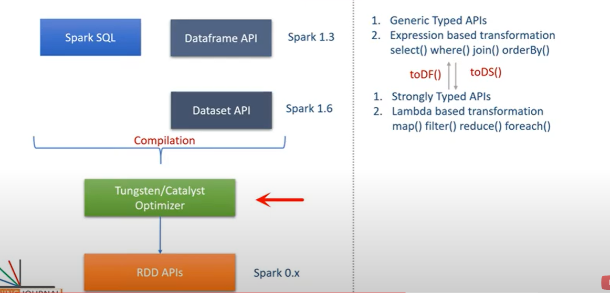

### Objective
Dataset is a data structure in SparkSQL, stringly typed and is map to
a relational schema, it represents structured queries with encoders.

It's an extension to data frame API. Spark dataset provides both type safety and OOP interface.

The encoder is primary concept in serialization and deserialization (SerDes) framework in Spark SQL. Encoders translate between JVM objects and Spark’s internal binary format. Spark has built-in encoders which are very advanced. They generate bytecode to interact with off-heap data.
An encoder provides on-demand access to individual attributes without having to de-serialize an entire object. To make input-output time and space efficient, Spark SQL uses the SerDe framework. Since encoder knows the schema of record, it can achieve serialization and deserialization.
Spark Dataset is structured and lazy query expression that triggers the action. Internally dataset represents a logical plan. The logical plan tells the computational query that we need to produce the data. the logical plan is a base catalyst query plan for the logical operator to form a logical query plan. When we analyze this and resolve we can form a physical query plan.
Dataset clubs the features of RDD and DataFrame.

In a nutshell, SparkSQL uses  SerDe framework, and the fact that it has a schema provide much faster speed for serialization
. The logical plan of spark tells the computational query abt the plan time. The logical plan is a base catalyst query plan for the logical operator to form a logical query plan.
Dataset has : 
- the convenience of RDD
- performance optimization of Dataframe
- static type-safety of Scala
Thus, Datasets provides a more functional programming interface to work with structured data.

### Advantage: 
- Optimized Query
- Analysis at compile time: we can check syntax and analysis at compile time. Unlike DataFrame, RDDs or regular SQL queries
- Persistent Storage : Spark Datasets are both serializable and Queryable. Thus, we can save it to persistent storage.
- Inter-convertible
- Faster Computation
- Less memory Consumption
- API for java and Scala

