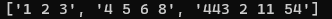
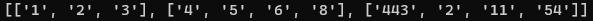

### Concept

- map is use as a maper of data from one state to another
- it will create a new RDD from the old one
- syntax will be 

###### example:
```python
rdd.map(lambda x:x.split())
```

To run the job, locate to the location 
```python
<your_project_dir>\Spark\SparkRDDs\Map\lambda
```
then submit the job
```
spark-submit Map.py
```

this pineline is doing the transofmation that is:

Taking the data from input.txt file, which is result as : 

to this result

and it's doing so by using the map(x:x.split()) function and applying the split logic
to every members of the beginning list.